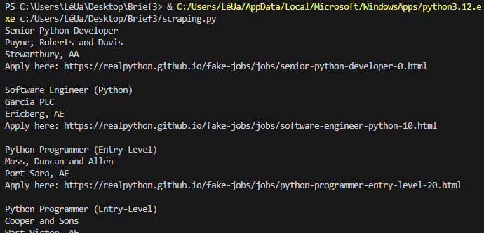

# Briefs 3 & 4 - Web scraping

## Objectifs
Découvrir le web scraping et apprendre à l'appliquer dans différents cas.

## Pré-requis
​* Python 3.12.6 & pip
* Installation des bibliothèques python : requests, beautifulsoup4

## Brief 3 - Initiation au scraping
Suivi du tutoriel (cf. Documentation annexe).  
Résultat obtenu :  

## Brief 4 - Challenges réalisés
* Quel le nombre de livres et le prix moyen qu'on retrouve dans chacune des catégories de [ce site web](https://books.toscrape.com/) (il faudra se log) ?
* Quel est le nombre de page qu'on retrouve sur [ce site web](https://quotes.toscrape.com/) ? 
* Quel le nombre de citations qu'on retrouve sur [cet URL](https://quotes.toscrape.com/scroll) ?
* Quel est la première citation sur [ce lien](https://quotes.toscrape.com/js/page/10/) ?
* Quelle est la cinquième citation sur [ce lien](https://quotes.toscrape.com/js-delayed/page/5/) ?
* Quel est le tag le plus répétitif sur [cette page](https://quotes.toscrape.com/tableful/) ?
* Quelle est l'unique citation d'Albert Einstein sur la musique à travers [ce formulaire](https://quotes.toscrape.com/search.aspx) ?
* Combien de temps vous faudra-t-il plus ou moins pour scraper tout le contenu de [ce site web](https://quotes.toscrape.com/random) ?

## Documentation annexe
* [Tutoriel - Web scraping avec python](https://realpython.com/beautiful-soup-web-scraper-python/)
* [Documentation BeautifulSoup4](https://www.crummy.com/software/BeautifulSoup/bs4/doc/)
* [Documentation requests](https://requests.readthedocs.io/en/latest/)
* [CNIL - Fiche RGPD](https://www.cnil.fr/fr/focus-interet-legitime-collecte-par-moissonnage)
